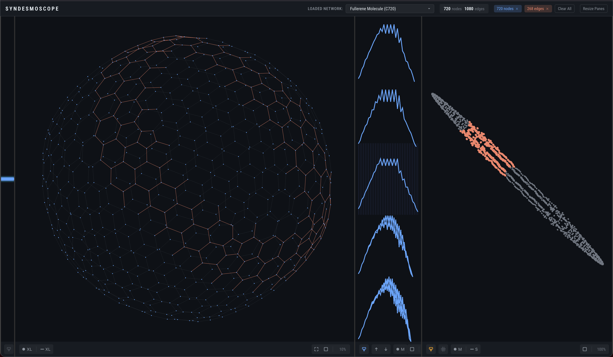

# Syndesmoscope: Linking Invariant Plots and Traditional Network Views


</a>

Syndesmoscope is a browser-based interactive system that enables deep exploration of network topology by coordinating multiple network visualization idioms through linked highlighting.

*The name 'Syndesmoscope' is a neoclassical compound word built from Greek roots: 'syndesmos', which means bond or link as a noun, or "to bind together" as a verb; and 'scope', which means "instrument for observing"; thus, "an instrument for observing connections".*

# Development Setup

These steps assume that `npm` is already installed on your machine. This repository does **not** store or track the required web app scaffolding dependencies, so the first step is to navigate to the `Syndesmoscope` working directory in your terminal and install these locally.

```bash
# Install the dependencies required for the project from package.json and package-lock.json
npm install
```

Then, run the following commands.

```bash

# Start the development server (run once per work session)
npm run dev

# Build the project for production deployment
npm run build
```

# Git Cheatsheet

Step 0 -- Download the repo through the Command Line Interface (CLI).

```
cd src
gh repo clone dirediredock/Syndesmoscope
cd Syndesmoscope
```

Step 1 -- Use `checkout -b` to create and name a new branch.

```
git status
git checkout -b local_edits
git status
```

Step 2 -- When work of the day is complete, commit all changes on VS Code, then return to Terminal and `push` the commits, then finally return to `main` for a fresh start next time.

```
git push
git push --set-upstream origin local_edits
git fetch origin main:main
git checkout main
```

Step 3 -- Back to Step 1.
