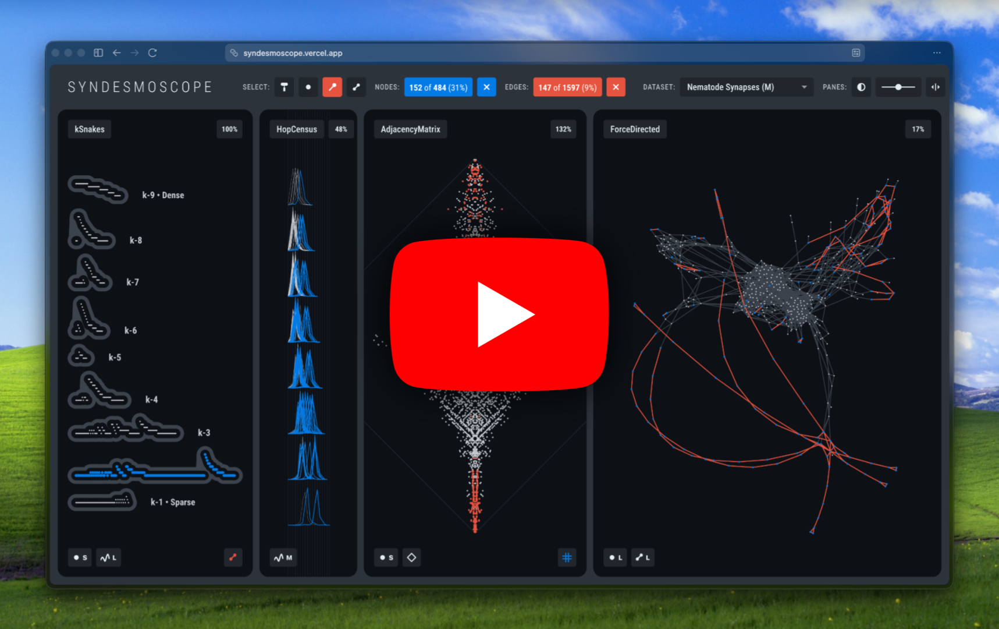
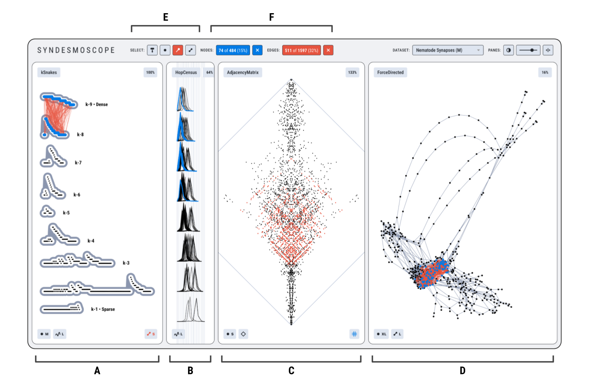

# Syndesmoscope: The Power of Invariant Plots Linked to Traditional Network Views

Syndesmoscope is an interactive visualization system that supports the topological exploration of a single graph through juxtaposed linked views of both invariant plots and traditional network visual encodings. The name 'Syndesmoscope' is a neoclassical compound word built from Greek roots: 'syndesmos', which is bond or link as a noun, or "to bind" as a verb; and 'scope', which is "instrument for observing"; thus, an "instrument for observing connections".

## Video Walkthrough

[](https://www.youtube.com/watch?v=2mrCo8tRtSo)

We explore Syndesmoscope through a series of datasets and usage scenarios: the Game of Thrones network (nodes as book characters, edges as interactions), an intuitive square grid (14 nodes per side), the Wikipedia science pages network, a Fullerene molecule (720 carbon atoms), a co-authorship graph of network science researchers, and the Western Power Grid (nodes as substations, edges as transmission lines). Through interactions like leapfrogging (linked selections across views with interpretable axes) and hopscotching (stepwise traversal of the underlying data structure), users can selectively highlight node and edge subsets, surfacing visual patterns that can identify central and peripheral regions, shells and subshells along the dense-sparse axis, structurally equivalent nodes, bridges between communities, symmetric structures, and counterintuitive topological anomalies.

## User Interface

Three of the Syndesmoscope views provide distinct visual patterns that arise from the tight mapping of interesting topological properties to interpretable geometric layouts (A, B, and C in the figure below), alongside a familiar and intuitive force-directed view (D in the figure below). 

<a href="https://syndesmoscope.vercel.app/"></a>

The user interface has four interpretable geometric layouts computed from the same graph (A, B, C, and D) and a control strip (E and F). **(A)** kSnakes pane, a new invariant plot based on the dense-sparse gradient; nodes from the two densest subgraphs selected at the top of the pane (blue), with hopscotching to select their edges (orange). **(B)** HopCensus pane, an invariant plot based on eccentricity. **(C)** AdjacencyMatrix pane, with a Fiedler seriation. **(D)** ForceDirected pane, a familiar variant view. **(E)** Hopscotching controls. **(F)** Selection set counts.

In the figure above, the 'Nematode Synapses (M)' neurological dataset represents the nervous system of the male C. elegans roundworm: 484 cells (nodes) and 1597 synapses (edges). The selection of the nodes from the 2 denset shells in kSnakes propagates to low eccentricity polylines in HopCensus, and to edge-points around the equator in AdjacencyMatrix. The ForceDirected pane shows these 74 nodes selected as a dense subgraph with a central topological placement.

# Development Setup

These steps assume that `npm` is already installed on your machine. This repository does **not** store or track the required web app scaffolding dependencies, so the first step is to navigate to the `Syndesmoscope` working directory in your terminal and install these locally.

```bash
# Install the dependencies required for the project from package.json and package-lock.json
npm install
```

Then, run the following commands.

```bash

# Start the development server (run once per work session)
npm run dev

# Build the project for production deployment
npm run build
```

# Git Cheatsheet

Step 0 -- Download the repo through the Command Line Interface (CLI).

```
cd src
gh repo clone dirediredock/Syndesmoscope
cd Syndesmoscope
```

Step 1 -- Use `checkout -b` to create and name a new branch.

```
git status
git checkout -b local_edits
git status
```

Step 2 -- When work of the day is complete, commit all changes on VS Code, then return to Terminal and `push` the commits, then finally return to `main` for a fresh start next time.

```
git push
git push --set-upstream origin local_edits
git fetch origin main:main
git checkout main
```

Step 3 -- Back to Step 1.
